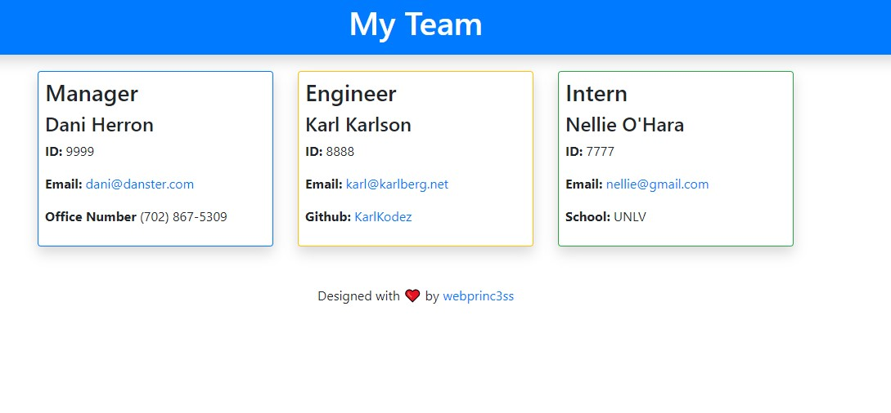
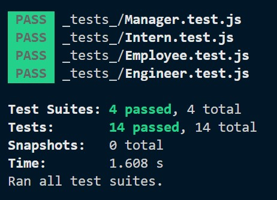

  # Team Profile Generator

   

   

  ## Table of Contents
  1. [Description](#description)
  2. [Installation Instructions](#installation-instructions)
  3. [Usage Information](#usage-information)
  4. [Tests](#tests)
  5. [License](#license)
  6. [Questions](#questions)
 
  
  ## Description
  The Porfolio Generator is a Nodejs app to assist managers on creating a team webpage via the terminal command-line.

  This application is created in Nodejs with the npm Inquirer, npm Validate and fs.write packages.

  Inquirer is used to prompt questions for the user which is then written, using the fs.write module, to a template which prints out the HTML file.

  Bootstrap was used in the styling of this project: https://getbootstrap.com/

  [Github Pages](https://webprinc3ss.github.io/team-profile-generator/)
  [Link to Demo](https://drive.google.com/file/d/15D-8fZEefxHCMzDap2_NxAWQDkJDv9hD/view)
  

  ## Installation Instructions
  1. [Clone the repo](https://github.com/webprinc3ss/team-profile-generator.git)

  2. [Install node.js](https://nodejs.org/en/)

  3. [Install npm Inquirer.js](https://www.npmjs.com/package/inquirer)

    npm install inquirer

  4. [Install npm validator.js](https://www.npmjs.com/package/inquirer)

    npm install validator

  5. [Install JEST](https://jestjs.io/docs/en/getting-started.html)
  
  6. Include "node_modules" in your own .gitignore file in case you want to upload this app to your own repo.
   
  ## Usage Information
  After you have installed the above, open your terminal and enter, "node index" in your terminal to start the app.
    
  ## Tests
  Tests have been created to test the classes in the _tests_ file using JEST. Run the suite of tests.

  npm run test 

  
    
  ## License
  This license is covered by the MIT license. 

  ## Questions
  Please feel free to contact me, webprinc3ss at Github: https://github.com/webprinc3ss 

  or

  djabranton@gmail.com. 
      